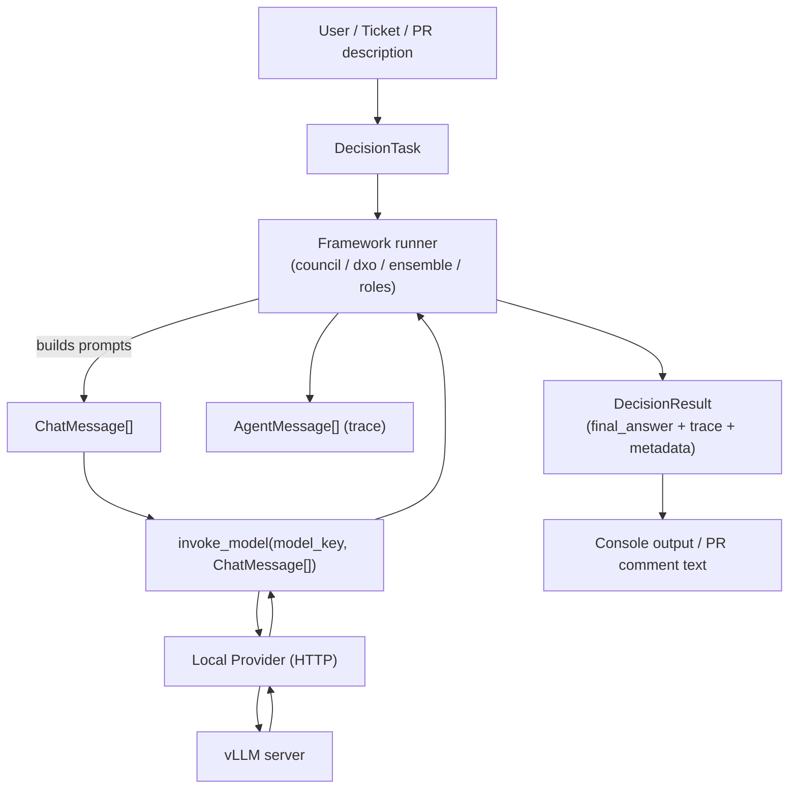
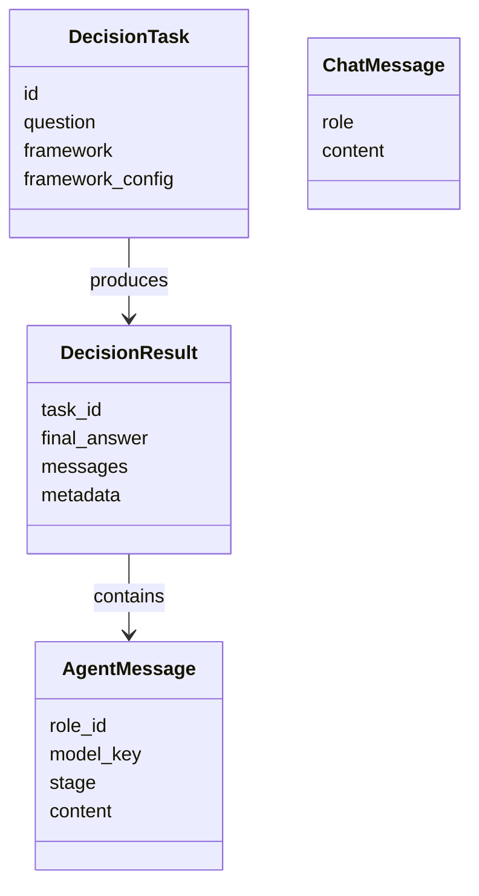
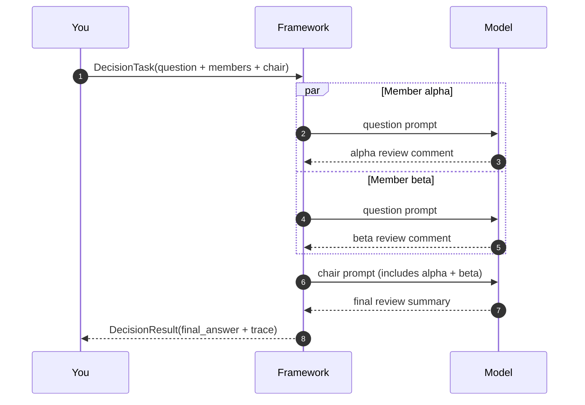
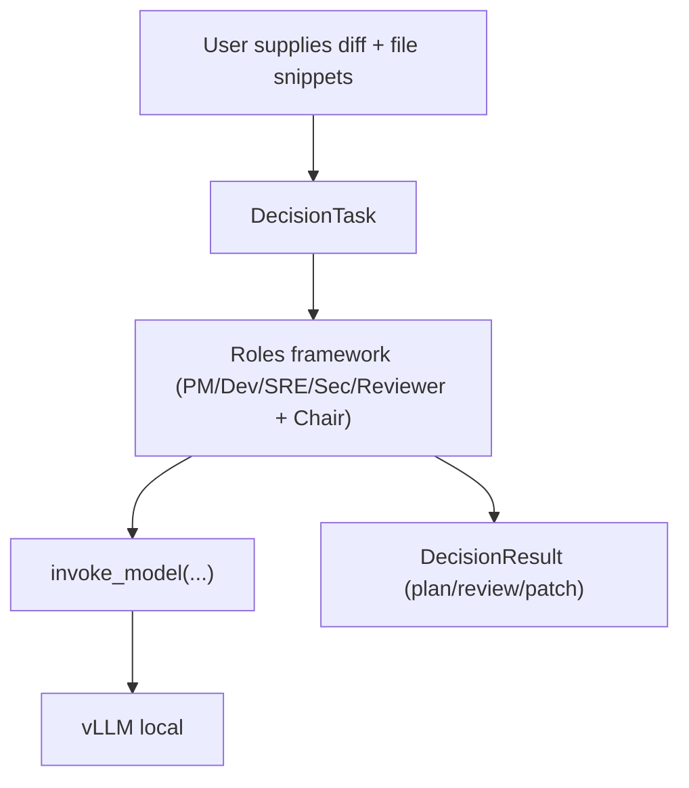
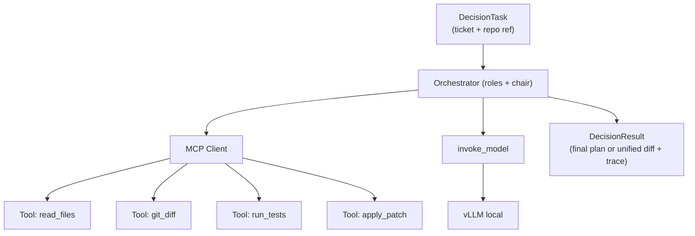
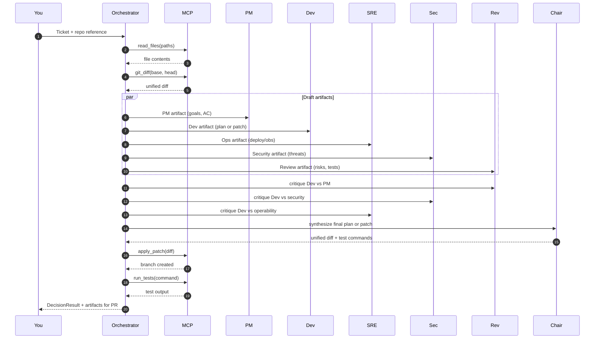

# Agentic Code Review Pipeline — How the Pieces Fit (Stage 1 → Stage 3)

This document explains the **architecture and data flow** of the agentic “GitHub-style code review” system we’re building, using your current objects:

- `DecisionTask`
- `ChatMessage`
- `AgentMessage`
- `DecisionResult`

It also shows how this evolves into a real GitHub workflow with **MCP tools** (filesystem, git diff, tests) later.

---

## The core idea

Think of this system as a **structured code review meeting**:

1. You provide a *ticket / PR description* (and later a diff + files).
2. Multiple specialized “roles” produce review artifacts (PM, Dev, SRE, Security, Reviewer).
3. A “Chair” synthesizes into a single final output (plan now; patch later).
4. Everything is captured as a trace so you can audit *why* the final answer was produced.

The “agents” are not magical beings. They are **model calls** that are *tagged* with role/stage and collected into a well-defined transcript.

---

## Map the objects to GitHub reality

### `DecisionTask` = the “PR request”
- Equivalent to: **Issue text**, **PR description**, or “ticket”
- Includes the chosen process (framework) and configuration (who participates)

### `ChatMessage` = a raw model prompt message
- Equivalent to: the *email / instructions* sent to a human reviewer
- Has a `role` (`system`, `user`, `assistant`) and `content`

### `AgentMessage` = one role’s output at one stage
- Equivalent to:
  - a reviewer’s comment
  - a security note
  - an SRE checklist
  - the chair’s final summary
- It is labeled with:
  - `role_id` (who)
  - `stage` (why/when)
  - `model_key` (which model produced it)
  - `content` (what was said)

### `DecisionResult` = the pinned PR summary + full transcript
- Equivalent to the final “review verdict” comment (approve/changes requested),
  plus the full set of individual role outputs.

---

## Data Flow Diagram (DFD)

This is the data flow for the **current system** (vLLM local provider), without MCP tools yet.

**What to notice:**
- Frameworks create prompts (`ChatMessage[]`).
- `invoke_model` is the single “model call” choke point.
- `AgentMessage[]` is the durable transcript.
- `DecisionResult` is the final package you render to a PR comment.

---

## Class-level “what carries what” diagram

---

## How a code review works end-to-end (step-by-step)

### Stage 1: “Review simulation” (what you can do now)
Input: PR text only.

1. You create a `DecisionTask`:
   - `question` = PR description
   - `framework` = `council` or `dxo` or `ensemble`
   - `framework_config` = which models play which roles

2. The framework runs:
   - Council: parallel reviewers → chair synthesis
   - DXO: research → critique → synthesis
   - Ensemble: anonymous parallel answers → aggregator

3. The framework returns a `DecisionResult`:
   - `final_answer` = what you’d paste as the “final review comment”
   - `messages` = trace of individual agent outputs

At this stage the system is a “review meeting” that only knows what you tell it in the ticket.

---

## Sequence diagram: Council as a code review meeting

Council maps naturally to “multiple reviewers + a final summarizer”.

---

## Stage 2: “Diff-aware review” (what we add next)

To do real code review, the model needs **actual code context**: a diff and/or file contents.

We add *context payloads* into `DecisionTask.framework_config`, for example:

- `diff_text`: unified diff string
- `files`: map of `{path: content}` for key files
- `test_commands`: suggested or existing test commands
- `constraints`: minimal diff, no new deps, API stability

Then the **Reviewer** can respond to *specific changes*, not just the ticket.

### DFD with “repo context” (still no MCP)

At this stage, you can paste diffs manually (or read them locally via a script).

---

## Stage 3: MCP makes it real (filesystem, git, tests)

MCP turns this into a genuine PR-producing system because agents can call tools:

- `read_files(paths)` → actual file contents
- `git_diff(base, head)` → real diffs
- `run_tests(cmd)` → actual test output
- `apply_patch(diff)` → generate a branch/patch

### DFD: Orchestrator with MCP tools

**Why this matters:**  
Without tools, the system “imagines” the repo. With MCP, the system *measures* the repo.

---

## A realistic role-specialized code review run (the target flow)

Here’s the flow you’re aiming for with your roles (PM, Dev, SRE, Security, Reviewer, Chair):

---

## Key takeaways (the “click” points)

1. **Frameworks are orchestration.**  
   They choose who speaks when, and what prompt they get.

2. **`invoke_model` is the choke point.**  
   It’s where routing, sampling, logging, retries, and later MCP integration can happen cleanly.

3. **`AgentMessage` is the transcript.**  
   It’s the durable record of each role’s work.

4. **`DecisionResult` is the PR-ready packet.**  
   It’s what you render into a GitHub comment, plus the evidence.

5. **MCP is how you stop hallucinating repo context.**  
   Tools provide the “ground truth” inputs that make review and patching reliable.

---

## Where we go next

- Add a **roles framework** where each role emits a **typed JSON artifact**.
- Add a `render_markdown(DecisionResult)` that formats the output like a GitHub review summary.
- Add MCP tools (thin first): `read_files`, `git_diff`, `run_tests` — then `apply_patch`.

That gets you quickly to a system you can *actually* use on real tickets and real diffs.
