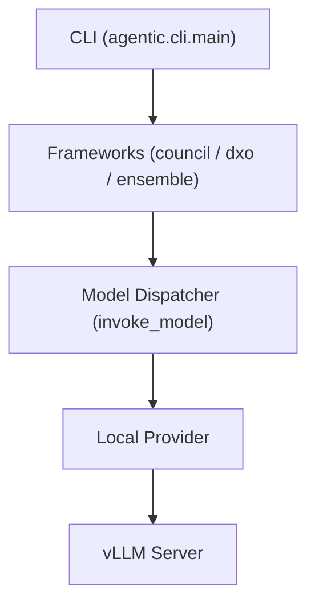
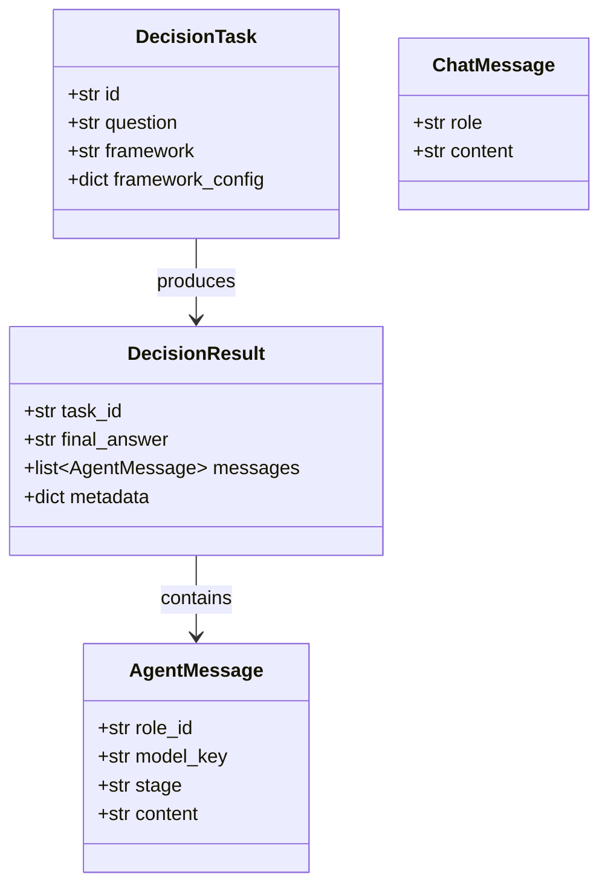
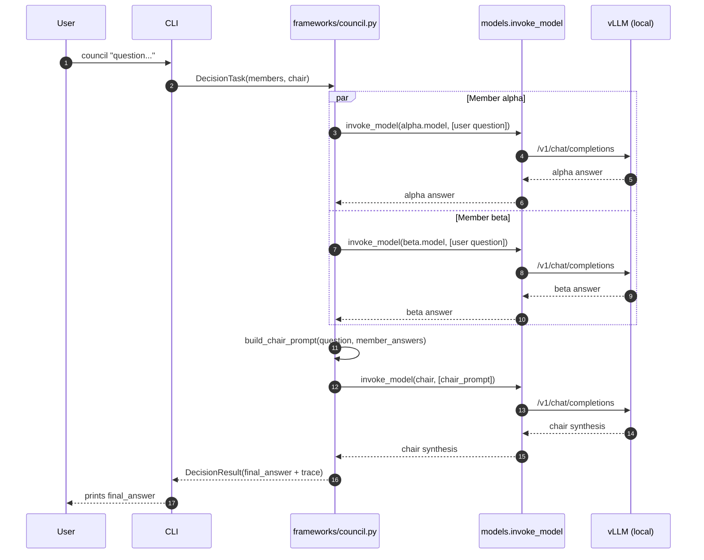
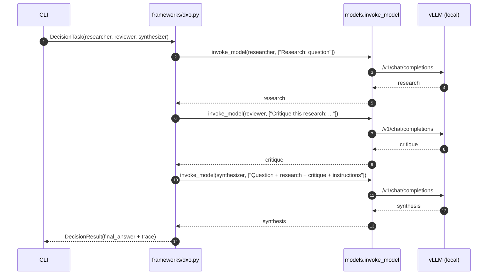
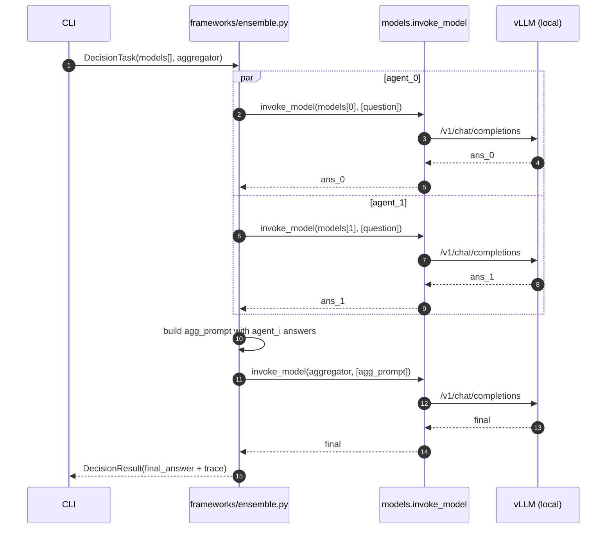

# Architecture

## Overview
The agentic system is a modular framework for orchestrating AI agents with pluggable providers and frameworks. Core components are organized by responsibility: models/types, HTTP providers, framework orchestration, and CLI integration.

## Directory Structure
```
src/agentic/
├── models.py          # Agent and response models
├── types.py           # Shared data types and configurations
├── providers/
│   └── local.py       # HTTP-based LLM provider (vLLM integration)
├── frameworks/
│   └── ...            # Orchestration logic (council, etc.)
└── cli/
    └── main.py        # Command-line entry point

tests/
├── test_models.py     # Model and invocation tests
└── test_*.py          # Framework/provider tests
```

## Core Components

### Models & Types (`models.py`, `types.py`)
- Dataclass-based agent and response definitions
- Type hints for configuration and runtime state
- Shared interfaces for provider implementations

### Providers (`providers/local.py`)
- HTTP client for remote LLM endpoints (vLLM)
- Async request/response handling with error propagation
- Configurable base URL via environment variables

### Frameworks (`frameworks/`)
- Orchestration engines (e.g., council runner)
- Agent coordination and result aggregation
- Placeholder stubs for future expansions

### CLI (`cli/main.py`)
- Experimental command-line interface
- Requires running LLM endpoint (e.g., `VLLM_BASE_URL=http://localhost:8000`)

## Data Flow
1. **Input**: CLI or API receives user query
2. **Provider Call**: Framework routes to provider (local HTTP endpoint)
3. **LLM Processing**: Remote service processes and returns response
4. **Output**: Formatted result returned to user

## Testing Strategy
- Async tests via `pytest-asyncio`
- Fixtures isolate network dependencies
- Coverage on model invocation, config loading, and framework control flow









ensemble flow diagram

